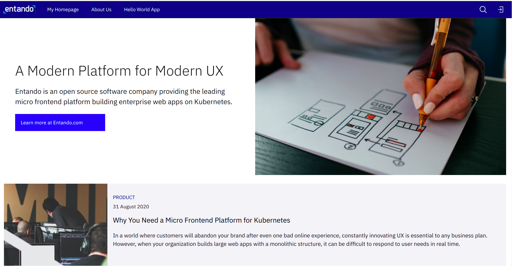

<!-- Use the terminal to execute shell script:

```
sudo ./start.sh
``` -->
<!--
``
For Every pass phrase use same password : entando
`` -->

Wait for 5-10 mins then check for pods:
```
sudo kubectl -n entando get pods
```

Watch Entando startup. It can take around 10-15 minutes before the application is fully deployed and ready.
```
sudo kubectl -n entando get pods --watch
```

Use the terminal to check for the Entando ingresses using
```
sudo kubectl describe ingress -n entando
```

Use the terminal to get the Entando ingresses using
```
sudo kubectl get ingress -n entando
```

Use the terminal to manually patch the eci-ingress next, once the ingresses are in place
```
sudo ./patch-cm.sh
```

It can take around 3 minutes before the pod `quickstart-cm-deployment` restarted and ready.


Click on `keycloak` tab to authenticate. It will open the login screen in new browser tab.

Once you see the login screen, enter the following login details:
- Username: admin
- Password: adminadmin


Change the password if required.

Click on `App Builder` tab inside instruqt and reload. It will show App Builder dashboard.

``Follow the Welcome Wizard. On completion of wizard it will open the newly created page in the external browser as shown below``



To complete this challenge, press **Check**.