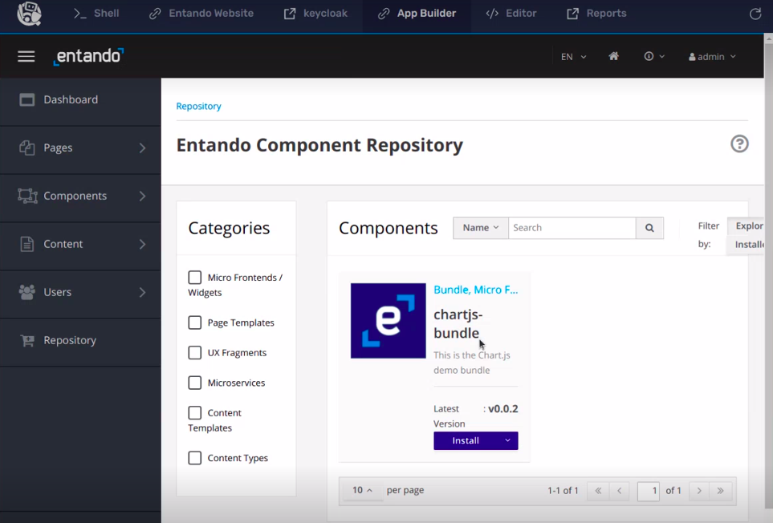

*This Challenge will demonstrate below things*
- Add MFE bundles to the repository
- Install the bundle
- Use the MFE widget on the page


Download chartjs.yaml:
```
wget https://gist.githubusercontent.com/nshaw/44b6d7dbc6d5b6ecf8aece4c45775ed1/raw/6da6ec18dc08e467f5328d3ffd9745d0561ecc84/chartjs.yaml
```
Use the terminal to apply file
```
sudo kubectl apply -n entando -f chartjs.yaml
```

Reload the App Builder UI and goto Repository tab on side bar of application. You can see MFE is ready to install.


Click on install button

# Add the MFE widget to page

In the Left Sidebar, Click on *Pages > Management*

Here, you'll see a list of pages that represent the page tree of your site.
Click Add in the bottom-right to create a new page.

## Enter the following required details:

- **Title:** used for SEO

- **Code:** must be unique

- **Page placement:** location of the Page in the Page Tree

- **Owner Group:** Group that has access to the Page

- **Page Template:** structure & presentation of the Page


Click on the ***Save and Design*** button at the bottom.

Once we save our settings, we can start designing our page with widgets and other components!

---

# Now we are in the Designer Section.

## Adding Widgets:

In the Right Sidebar, search for newly created MFE widget `chart.js`
Drag & drop the widget into the dotted grey 'Frame1' section on the page.

---

Click ***Publish*** at the bottom to see your page live.

---