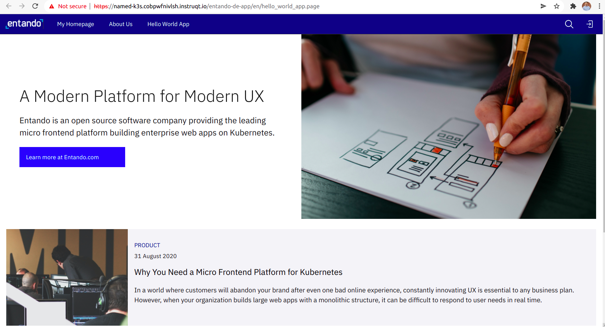

**APP BUILDER OVERVIEW**

For this challenge, all modules, content, and page layouts have been prebuilt by Creators.  We will assemble them into a single application as shown in this example: 

Entando's low code **App Builder** is a web interface that allows Composers to define pages, users, roles, access policies, and web content, it also enables composers to assemble content and modules onto those pages.  

Let's begin this tutorial by using Entando's OOTB wizard to provide a basic overview of the **App Builder**'s features.   

In the web window **enter**:  

_Username_: **admin**

_Password_: **adminadmin**

(Note: After your 1st login, it will ask you to create a new password.  **Please enter one now**.)

Once you’re logged in, a pop-up wizard will appear with instructions for creating your first web page.

Complete the steps then click **CHECK** within this window to continue to your next challenge.
