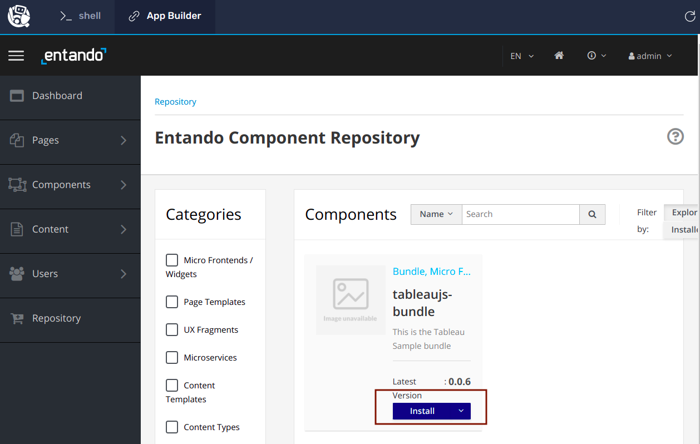
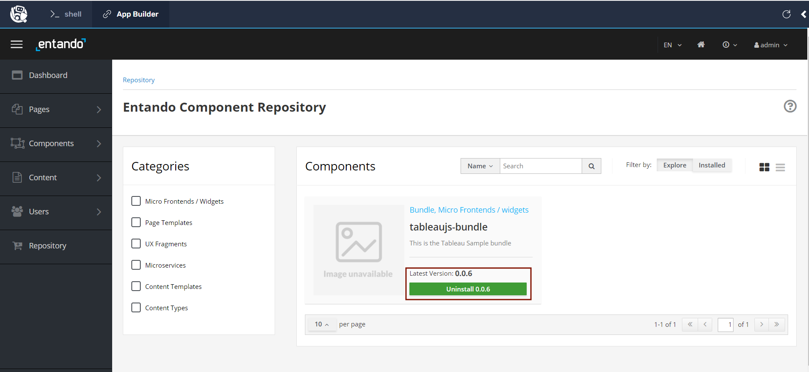
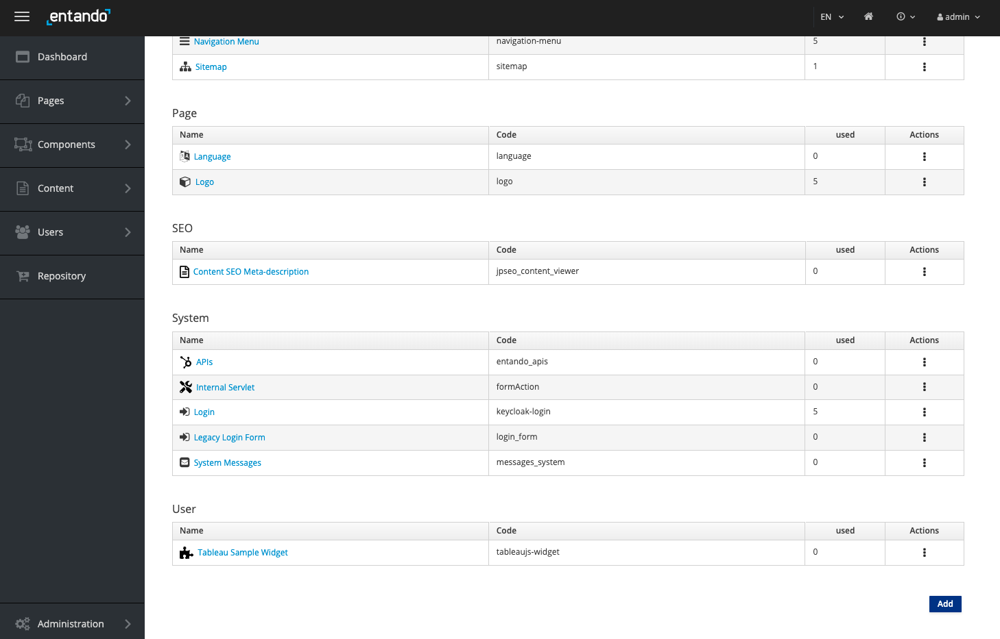

**INSTALLING PBCs INTO THE APP BUILDER**

**STEP 1: ADD THE NEW  PBC INTO THE LOCAL REPOSITORY**

A **Creator** (an individual developer or a developer team) has created a new Tableau Packaged Business Capability (**PBC**) displaying SAP Returns. Your goal as a **Composer** is to add this to the current application. <span style="text-decoration:underline;">(Ensure you are on the Shell tab on the left.)</span>

**<span style="text-decoration:underline;">Run</span>** the following command to deploy the Tableau PBC into our local **Component Repository** (which holds all modules which Composers can use to deploy into apps).


```
ent bundler from-git -r https://github.com/entando-samples/tableau-example-bundle -d | ent kubectl apply -n entando -f -
```

This command will pull the module's code from **Github** and configure new resources in **Kubernetes** allowing the module to now be used within our **App Builder**. 

**STEP 2:  INSTALL THE PBC INTO OUR APP BUILDER**

On the left, **<span style="text-decoration:underline;">click on the App Builder tab</span>**, 

then **<span style="text-decoration:underline;">click on the "Don't show next time</span>** checkbox, and  

then **<span style="text-decoration:underline;">click Close </span>** and **<span style="text-decoration:underline;">click Yes</span>** to end the wizard. 

In the Left Sidebar, **<span style="text-decoration:underline;">click Repository.</span>**

As shown below, inside the tableaujs-bundle card, **<span style="text-decoration:underline;">click on the Install button.</span>**



As shown below, after the installation process is finished, the install button will switch to an **uninstall** green button.



Note, this process can be used to update or downgrade the version of any specific PBC.  

**STEP 3: VERIFY THE PBC IS AVAILABLE**

In the Left Sidebar, **<span style="text-decoration:underline;">Click on Components > Micro Frontends & Widgets.</span>**

All out-of-the-box and user-installed components and PBCs are listed here.   Scroll down to the **User** section.   Observe that your tableaujs-bundle is displayed here and is now available to add to various pages in your application. 



Congratulations! You have completed this challenge.  In the next challenge, you will learn how to create a page which includes this PBC. 

When you are ready, validate this challenge by clicking **<span style="text-decoration:underline;">Check</span>**.
