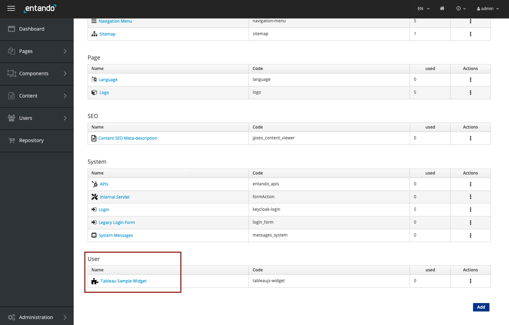

Hi Consumer,
Our Curator has validated the Tableau PBC and it is now available.

Please run the following command to deploy it in our Component Repository, where all components used in the application are listed.

```
ent bundler from-git -r https://github.com/entando-samples/tableau-example-bundle -d | ent kubectl apply -n entando -f -
```

Once it's registered, we need to install it from our Entando Component Repository (ECR). The installation process configures new resources on Kubernetes to run our components.

To execute that task, be sure to be on the **App Builder tab**.

In the Left Sidebar, Click on **Repository**.

Click on the install button.


When the installation process is finished, the install button switches to an uninstall plain green button.


---

You can navigate to the components entry list to see newly installed components from the PBC.

In the Left Sidebar, Click on **Components** > **Micro Frontends & Widgets**.

All the micro frontends and widgets are listed here. If some are available out of the box, the installed components from the PBC are available under the **User** section.

The **Tableau Sample Widget** is here.



---

Congratulations! You completed this challenge in which you've installed your first PBC.

The next challenge will learn you how to create a page and compose it with the component included in the PBC.
When you are ready, validate this challenge by clicking **Check**.

