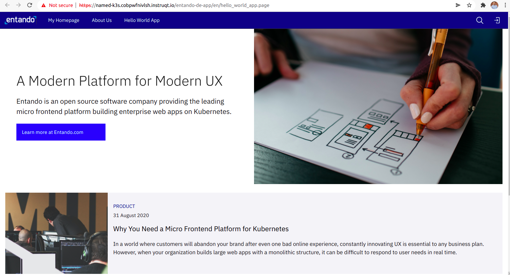

Click on `Authentication` tab to authenticate. It will open the login screen in new browser tab.

Once you see the login screen, enter the following login details:
- Username: admin
- Password: adminadmin

Change the password if required.

Click on `App Builder` tab inside instruqt and reload. It will show App Builder dashboard.

`Follow the Welcome Wizard. On completion of wizard it will open the newly created page in the external browser as shown below`

To complete this challenge, press **Check**.
