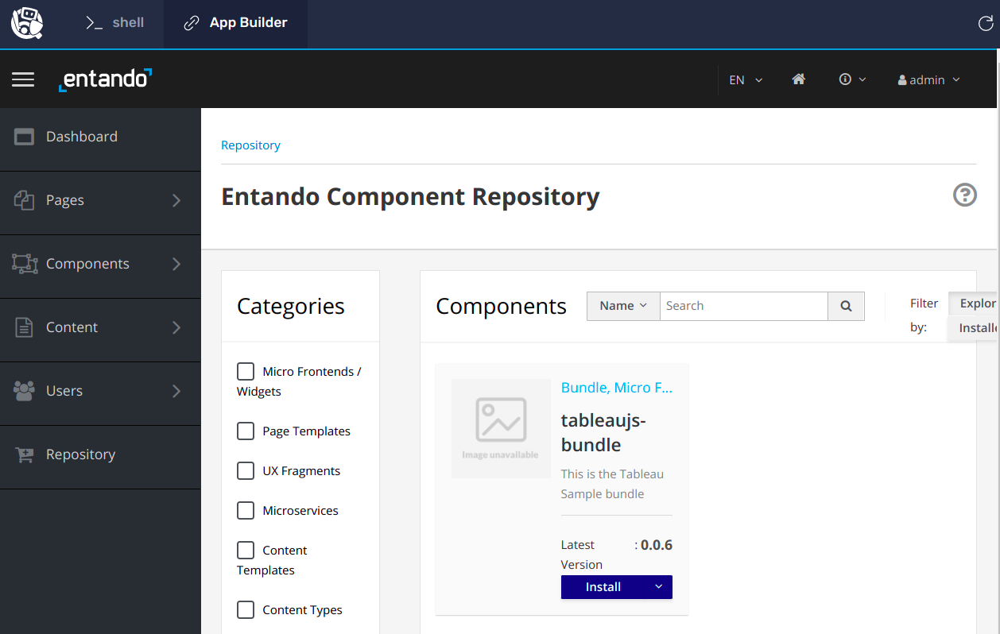

# Install the tableau js bundle

Execute below command:
```
ent bundler from-git -r https://github.com/nshaw/2021-12-tableau-bundle.git -d | ent kubectl apply -n entando -f -
```

Goto App Builder tab > goto Repository tab on side bar of application. You can see MFE is ready to install.


# Click on Install button & wait for successful installation.

