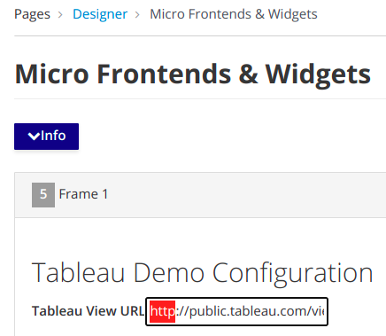

# Add the MFE widget to page

In the Left Sidebar, Click on *Pages > Management*

Here, you'll see a list of pages that represent the page tree of your site.
Click Add in the bottom-right to create a new page.

## Enter the following required details:

- **Title:** tableau

- **Code:** tableau

- **Page placement:** click on Home

- **Owner Group:** Free Access

- **Page Template:** 1 Column

Click on the ***Save and Design*** button at the bottom.

Once we save our settings, we can start designing our page with widgets and other components!

---

# Now we are in the Designer Section.

## Adding Widgets:

In the Right Sidebar, Scroll down and expand the **Page** menu
Drag & drop the **Logo widget** inside the dotted grey **'Logo'** section on the page.

In the Right Sidebar, Scroll down and expand the **User** menu
Drag & drop the **Tableau Sample Widget** inside the dotted grey **'frame1'** section on the page.

Change the *http to https* in the URL and click on *Save* button

---

<!-- Click ***Preview*** at the top to see what your page will look like before you publish! -->

Click ***Publish*** at the bottom.

Click ***View Published Page*** at the right top to see your page live.

---